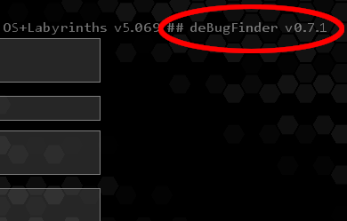

# deBugFinder
Hacknet Extension debugging tool based on [Pathfinder](https://github.com/Arkhist/Hacknet-Pathfinder).

# Installation

To install DeBugFinder, do the following:
1. Obtain `DeBugFinderPatcher.exe` and `DeBugFinder.dll`.
2. Copy both files into your Hacknet directory.
3. Run `DeBugFinderPatcher.exe` from that directory.

Assuming everything went right, you should now see a `HacknetDeBugFinder.exe` in the directory listing.

If you're on Windows, simply run this file to launch Hacknet with DeBugFinder.
If you're on another platform, run the generated `HacknetDeBugFinder` (no extension) file instead.

## Installation verification

Look for this tag next to Hacknet's version information:


# Compiling

Required to compile are the following:
* A C# compilation setup, including `msbuild`. On Windows you can get this via [Visual Studio](https://visualstudio.microsoft.com/), on other systems it's typically included with an appropriate [Mono](https://mono-project.com) install.
* Some way to run .Net assemblies. This may be native support (on Windows), or a Mono install.

## Express compilation and installation
Additional Requirements:
* A text editor
* A bash shell

This procedure only works if you have a bash shell available.
Open the `run.sh.config` file in this project, and fill in the appropriate variables:
* `hacknet_dir` should contain the full path to your Hacknet installation.
* `exe_prefix` should contain whatever you need to write in front of exe files to run them. On Windows, make this the empty string. On other platforms, the default (`mono`) is typically okay.
* `builder` should contain whatever command you need to write to build `.csproj` projects. With the appropriate paths set, the default (`msbuild`) should be fine.
* `configuration` should contain which configuration you wish to build. `Debug` is typically fine.

Then, simply run this command in the project directory: `./run.sh patcher spit build patch-init copy`
If everything went right, the last two lines should something like: (actual paths may vary.)
```
Writing /home/fayti1703/.steam/steam/steamapps/common/Hacknet/Hacknet-deBugFinder.exe
'DeBugFinder.dll' -> '/home/fayti1703/.steam/steam/steamapps/common/Hacknet/DeBugFinder.dll'
```
Congratulations, you just:
* Built the `patcher` from source
* Performed a `spit` patch
* `build`(*) the main DeBugFinder dll from source
* `patch-init`ed your Hacknet binary
* And `copy`ed the DeBugFinder dll to your Hacknet directory.

If you change anything, you can start the command line from the relevant step instead.
In addition, I recommend you replace the `patch-init` step with just `patch` -- the latter doesn't rewrite the launcher files (if any).

For instance, if you don't change the patcher at all, `./run.sh build patch copy` only rebuilds the main DLL and goes on from there.

(* yes, I know, it's 'built'. That doesn't *quite* work with the step name, though.)

## Manual compilation and installation
Additional requirements:
* The ability to copy files

This procedure should work anywhere, but requires a bit more work, especially if you do it repeatedly.

Open a developer command prompt of some sort. On Windows, you should find an appropriate option in the start menu. On other platforms, a regular terminal is usually fine.

(Portability note: I'll be using `mono` to prefix executables to run, and `msbuild` to prefix projects to build -- if those commands are different for your system (say you're on Windows) change them to the appropriate equivalent.
For instance, on Windows, just leave out `mono `.

Also, if at any point you see **red text**, stop. Something's gone wrong. If you can read through the error messages and fix it; do that and then continue.
Otherwise, seek assistance from someone who does know what's going on.)

1. Navigate to this project's directory in the command prompt.
(you can easily do this by copying the path to it and pasting it into your terminal after typing `cd `.
If you're on Windows and on the wrong drive, typing the drive letter followed by a colon, e.g. `D:`, switches to the right drive.)

2. Type `msbuild DeBugFinderPatcher/DeBugFinderPatcher.csproj` to build the patcher.
3. Type `cd lib` to enter the `lib` directory, then run `mono ./DeBugFinderPatcher.exe -exeDir %HACKNET_DIR% -spit`. Make sure to replace `%HACKNET_DIR%` with the path to your Hacknet directory.
4. Type `msbuild ../DeBugFinder/DeBugFinder.csproj` to build the main DeBugFinder dll.
5. Type `mono ./DeBugFinderPatcher.exe -exeDir %HACKNET_DIR%` to properly patch your Hacknet binary.
6. Then, simply copy the `DeBugFinder.dll` file from the `lib` directory into your Hacknet directory.

And you're done! That's the manual compilation process. Note that like the express compilation, if you, for instance, don't modify the patcher, you don't need to rebuild it.
Just pick up from step 4. (but make sure you're in the `lib` directory!)

For repeated builds, it may also make sense to add the argument `-nolaunch` in step 5. This skips rewriting the launcher files (if any) every patch.

## Packaging
In case you're compiling DeBugFinder to send to someone else, you only need to include the `DeBugFinderPatcher.exe` and `DeBugFinder.dll` files.

Your peer only needs to complete the installation instructions above with those two files.

# Usage

Eight commands have been added to the in-game terminal:
* `deccode`:
    Prints the internal code value used in DEC encryption for each string provided.
* `detags`: 
    Manage debugging tags. This command is split into various subcommands:
    * `detags` (no arguments): Lists the currently active debugging tags
    * `detags list`: Lists all available debugging tags
    * `detags <tag name> {on/true/add}`: Add the tag `<tag name>` to the active set.
    * `detags <tag name> {off/false/remove}`: Remove the tag `<tag name>` from the active set.
    * `detags <tag name> {get/status}`: Print the status of the tag `<tag name>`.
* `hublockdump`:
    Dumps the mission lock info from the currently connected node's first MissionListingServer, if any.
* `dumpfact`:
    Dumps the current faction information.
* `launchopt <launchopt> [on/off/toggle]`:
    Manipulates launch options. Available launch options:
    * `debug` (`-enabledebug`)
    * `fc` (`-enablefc`)
    * `web` (`-disableweb`)
    * `hex` (`-disablebackground`)
    * `nodepos` (no equivalent, previously unusable debug feature)
* `nodeoffset`:
    Control the Nearby Node Offset Viewer, aka the `positionNear` debugger. Subcommands:
    * `nodeoffset root-node`: Set the current node as the root node (`target` attribute)
    * `nodeoffset leaf-node`: Set the current node as the leaf node (the one `positionNear` would be on)
    * `nodeoffset start`: Begin the rotatening
    * `nodeoffset stop`: Stop the rotatening
    * `nodeoffset config <delay> <total> [extra] [max-pos] [min-pos]`: Configure the rotatening:
        * `<delay>`: How many milliseconds between updates. Double-precision floating-point
        * `<total>`: `total` attribute.
        * `[extra]`: `extraDistance` attribute. Defaults to `0`
        * `[max-pos]`: Maximum value for the `position` attribute. Defaults to `<total>`
        * `[min-pos]`: Minimum value for the `position` attribute. Defaults to `0`
    * `nodeoffset once <pos> <total> [extra]`
        * `<pos>`: `position` attribute.
        * `<total>`: `total` attribute.
        * `[extra]`: `extraDistance` attribute. Defaults to `0`.
    * `nodeoffset clear-debug`: Clear the "attempted positions" list, rendered with `launchopt nodepos on`
* `shutdown`:
    Quit the current session, as if you clicked "Exit to Menu" on the "Quit HacknetOS?" popup. Save before you do this.
* `vmexit`:
    Quits the game entirely. Yes, from directly within a session. **Save before you do this.**
    

## Debugging Tags

An explaination of all debugging tags:

### HacknetError
This tag logs most errors caught by Hacknet, most notably the `Hacknet.Util.AppendToErrorFile` function.
However, the exception catches in `Hacknet.OS:Draw` and `Hacknet.OS:Update` are also logged under this tag.

### MissionFunction
This tag logs all mission function runs.

### MissionLoad
This tag logs all (successfully) loaded missions. The output format is as follows:<br>
> Loaded Mission &lt;mission name&gt;<br>
> startMission = &lt;missionStart function&gt; / &lt;missionStart value&gt;<br>
> endMission = &lt;missionEnd function&gt; / &lt;missionEnd value&gt;

### MissionGoal
This tag logs unsuccessful mission completions caused by goals,
and the specific goal type causing them to fail.
Note that for missions with `activeCheck="true"`, a mission completion is attempted *every frame*, 
which **may result in some significant log spam**. Use with caution.

## MissionComplete
This tag logs *successful* mission completions. Unlike the above tag, it will only fire once per mission.

### SenderVerify
This tag logs unsuccessful mission completions caused by sender verification.<br>
Sender verification is a feature of `MailServer` that ensures only replies sent to 
the appropriate sender of the mission triggers a mission completion attempt.

### HasFlags
This tag logs checking of the `HasFlags` condition, the result of that check, and which flag caused it to fail.<br>
Note that condition checking is performed *every frame*, so this tag **results in significant log spam**.

### ActionLoad
This tag logs all action file loads. Only the file name itself is logged.

### ActionLoadDetail
This tag logs information about action loading, specifically the action elements themselves.

### ActionLoadDetailDetail
This tag logs information about condition and action loading, 
tracking the reader state every step of the deserialization 
(except for the part covered by `ActionLoadDetail`).
This, of course, **results in significant log spam** for any action file longer than a few lines.

### DisableDelayProcessing
This tag logs nothing. Instead, it prevents all (`Fast`)`DelayableActionSystem`s from updating. This includes
`IRCDaemon`s, `DHSDaemon`s and `FastActionHost`s.

### WriteReport
This tag logs all data that would be written to `report.txt`, provided that the write succeeds. It usually does, however, some
issues, like opening too many files in the mission parser, cause the report writes to fail.<br>
In order to properly use this tag, you may have to (ab)use the fact that the active set is not cleared between Hacknet sessions, only when you restart Hacknet itself.

### SaveTrace
This tag logs a complete stack trace of every single save attempt, 
both using the "normal" `Hacknet.OS:saveGame` method, which launches a new thread to handle the save, 
and direct execution of `Hacknet.OS:threadedSaveExecute`.<br>
Note that all calls to `Hacknet.OS:saveGame` cause two log messages to be produced. 
This is unavoidable without causing threading issues.<br>
In addition, capturing the stack trace is a rather slow operation, so **expect performance to suffer** if you save with this tag active.

### ComputerCrash
This tag logs whenever a computer crashes, a computer forkbombs its clients (Shell Tap),
a HackerScript dies due to a computer crashing or a computer boots back up.

### MissionLoadTrace
This tag logs a complete stack trace whenever a mission load begins.
Capturing the stack trace is a rather slow operation, so **expect performance to suffer** during mission loads with this tag active.

### PortUnmapping
This tag logs the result of the displayed port to "code port" conversion whenever it happens.

### ActionExec
This tag logs any and all actions that triggered to run or enqueued on a DelayHost.
Depending on how extensively an Extension uses Actions, **expect log spam**.

### DeleteFile
This tag logs some extra information about the `DeleteFile` action, mainly how many files matched the criteria and how many were found afterwards.
Yes, you can have more than one file with a given name. *Please* don't abuse this information.

### NodeLoad
This tag logs when what node is loaded.

### Flags
This tags logs any and all flag additions and removals.

### Music
This tag logs changes to the game's music. By which I mean *any* changes. 
Loading songs, transitioning, muting, stopping, playing...
